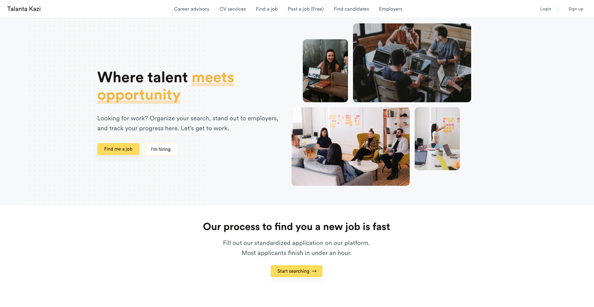

## talanta kazi

    Talanta kazi staff scouting application

#### Simple but complicated talanta kazi

## Description

This application will be used for recruitment of staff for different roles in
companies and placement of the staff in the companies

This is a [Next.js](https://nextjs.org/) project bootstrapped
with [`create-next-app`](https://github.com/vercel/next.js/tree/canary/packages/create-next-app).

### Development set up

1. Install [`Node JS`](https://nodejs.org/en/).
2. To clone,
   run `git clone https://gitlab.safaricom.co.ke/service-availability/onboarding-service/frontend/onboarding-service.git`.
3. `cd` into the root of the **project directory**.
4. Run `npm install` on the terminal to install dependencies.
5. Create a `.env.local` file in the root directory of the application. Example
   of the content of a `.env.local` file is shown in the `.env.example`
6. Setup local development server.

### Development server

Run `npm run dev` for a dev server. Navigate to `http://localhost:3000/`. The
app
will automatically reload if you change any of the source files.

### Build

Run `npm run build` to build the project. The build artifacts will be stored in
the `.next` directory

## Running unit tests

Run `npm run test:unit` to execute the unit tests. This is achieved through the
use of
jest package which is used to test javascript code.

Run `npm run test:unit:coverage` to execute the unit tests and generate a
coverage report.

## Running end-to-end tests

Run `npm run test:e2e` to execute the end-to-end tests. This is achieved
through the use of
playwright package which is used to test the application as a whole.

## Learn More

To learn more about Next.js, take a look at the following resources:

- [Next.js Documentation](https://nextjs.org/docs) - learn about Next.js
  features and API.
- [Learn Next.js](https://nextjs.org/learn) - an interactive Next.js tutorial.

You can check
out [the Next.js GitHub repository](https://github.com/vercel/next.js/) - your
feedback and contributions are welcome!
